# plato
Plato is a unity extension skill system.The editor is somehow like the timeline editor.Feel free to use it.  柏拉图是一个拓展的技能编辑器，欢迎入坑。
## 预览
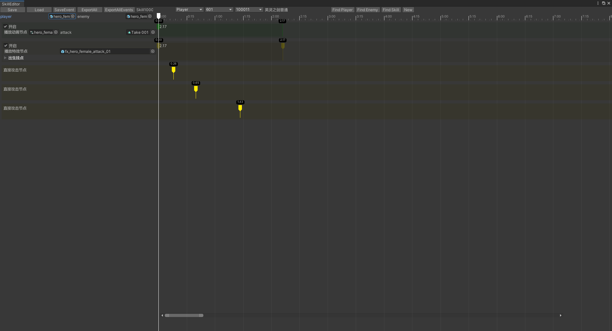  
## 拖拽时间线可以实时预览    
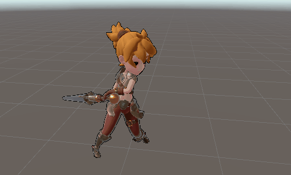
---
## 怎么使用
1. 技能表单配置相关说明
   1. 表格位置 ./tools/design/
   2. 导表工具使用  
    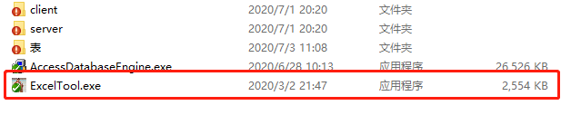  
   如果不能正常使用，报错，安装下AccessDatabaseEngine.exe  
   3. 打开后如下图  
    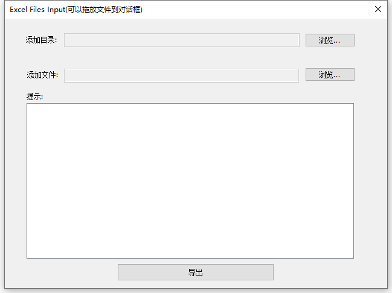
   4. 把目录中的表的文件拖入提示框，点击导出即可  
    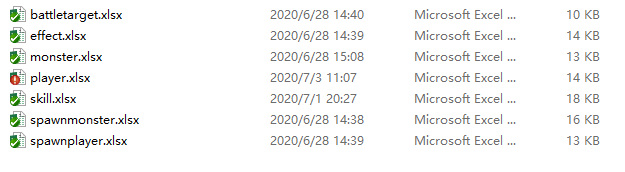
   5. 目录参考：./tools/design/client  
    替换所有文件即可   
    注：上述目录可以自行替换
2. 技能配置流程
    1. 点击Tools菜单栏，点击Table  
      
    2. 点击 ***按钮csv转c#*** 和 ***按钮csv转lua***   
      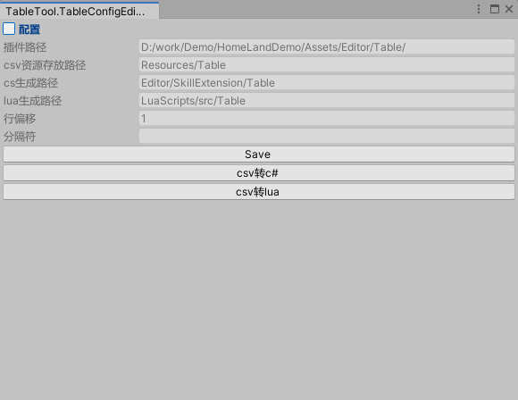  
      完成技能的配置导入
    3. 点击Tools菜单栏，点击Skill/Editor    
        
      打开技能配置界面  
      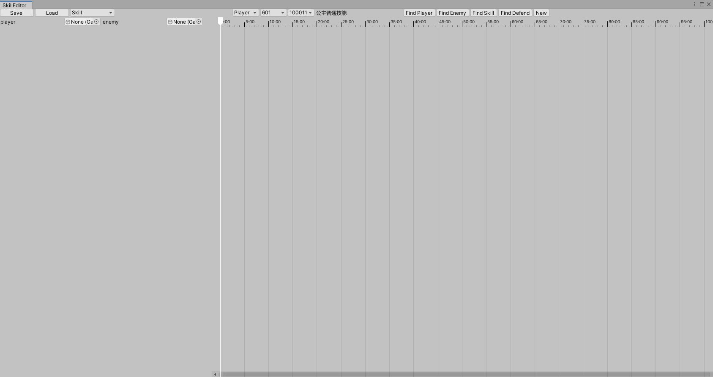
      即可配置技能
    4. 选中一种技能   
      
    5. 或工具栏按钮创建一个新技能    
      
    6. 拖拽时间线，右键新建节点  
      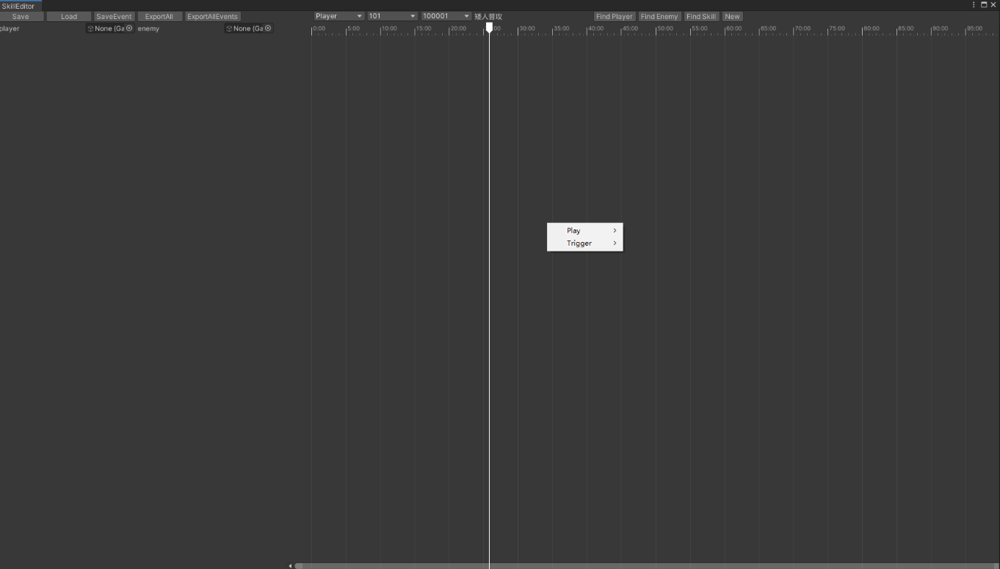  
      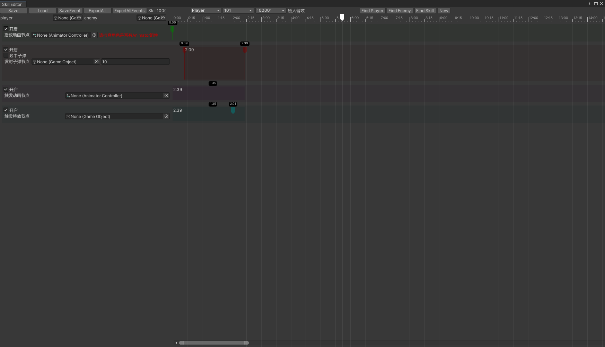  
    7. 编辑完成Save即可  
      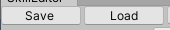
---
## 节点说明
编辑节点说明
1. 动作节点，在某个时间点播放一个动作    
   
2. 子弹节点，在某个时间点发射子弹，会触发节点Trigger开头的节点    
   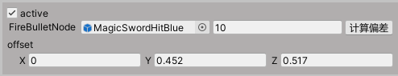
3. 触发动作，受击触发后播放对象的动作    
   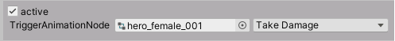
4. 触发特效，受击触发后播放特效（触发位置）  
   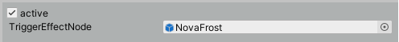
